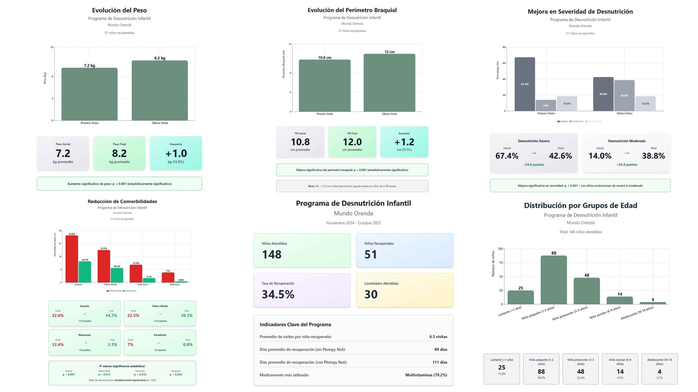
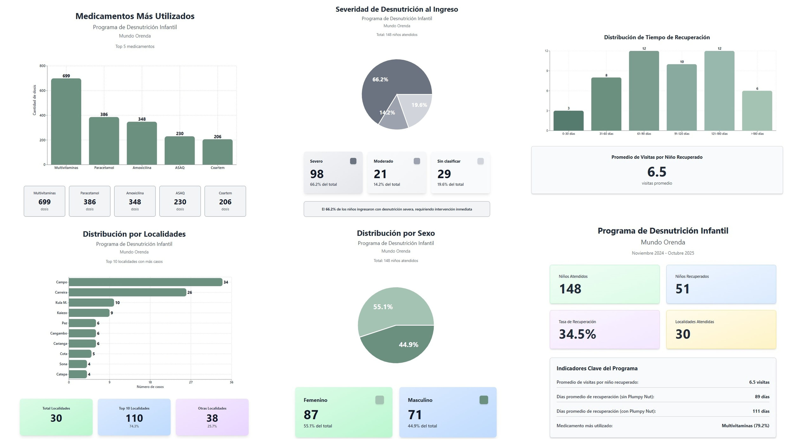

# 🩺 Proyecto Mundo Orenda — Análisis de Datos de Salud Comunitaria

## 🌍 Descripción general

**Mundo Orenda** es un proyecto de análisis de datos sanitarios centrado en la mejora del seguimiento clínico y nutricional de pacientes en comunidades vulnerables.  
El objetivo principal es **limpiar, estandarizar y analizar datos clínicos** para identificar patrones de atención médica, tratamientos más frecuentes y evolución temporal de los pacientes.

El proyecto integra un **pipeline de procesamiento de datos en Python (pandas)** y una serie de **visualizaciones estadísticas** que resumen los hallazgos clave en paneles gráficos.

---

## 📊 Objetivos del proyecto

- Unificar y limpiar registros médicos provenientes de diferentes fuentes.  
- Detectar y corregir inconsistencias en nombres de medicamentos, fechas y estados de alta.  
- Clasificar a los pacientes según rangos de edad y patrones de tratamiento.  
- Analizar la distribución del uso de medicamentos, con especial foco en **Plumpy Nut** y suplementos nutricionales.  
- Crear visualizaciones claras que permitan comunicar hallazgos a los equipos médicos y logísticos.

---

## 🔄 Pipeline de limpieza y procesamiento de datos

El flujo de trabajo principal del proyecto se organiza en **etapas modulares**, ejecutadas secuencialmente en un Jupyter Notebook o script Python:

### 1️⃣ Carga de datos
- Importación de los datos originales (`.xlsx`, `.csv` o `.sav`).
- Conversión de nombres de columnas a un formato estandarizado (`snake_case`).
- Tipificación de columnas críticas (`Data`, `NHC`, `Alta`, `Indicaçoes`, etc.).

### 2️⃣ Limpieza de fechas
- Conversión de las fechas con `pd.to_datetime(errors='coerce')`.
- Eliminación de los valores inválidos o vacíos.
- Detección de visitas con fechas fuera del rango esperado.

### 3️⃣ Normalización de medicamentos
- Aplicación de un **diccionario de estandarización** (`medicamentos_estandar`) que agrupa variantes de escritura  
  (por ejemplo: “amoxacilina”, “amoxicilina”, “amoxilina” → `Amoxicilina`).
- Expansión de la columna de medicamentos en filas individuales.
- Identificación de pacientes que han recibido **Plumpy Nut** o equivalentes (`planpynut`, `plympy nut`, etc.),  
  generando una columna binaria `plumpy_nut` con valores `"Si"` o `"No"`.

### 4️⃣ Cálculo de métricas por paciente
- Agrupación por `NHC` para obtener:
  - `primera_visita`
  - `ultima_visita`
  - `numero_visitas`
  - `dias_entre_visitas`
- Marcado de pacientes con fechas incompletas (`NaT`).
- Reasignación automática de `Alta = "No"` si se detectan visitas posteriores a la fecha de alta.

### 5️⃣ Clasificación por grupo de edad
- Cálculo de edad en meses y agrupación en rangos oficiales (`Lactante`, `Preescolar`, `Escolar`, `Adolescente`, `Adulto`, `Adulto mayor`).

### 6️⃣ Filtrado final
- Eliminación de registros con última visita en noviembre (pacientes aún en seguimiento).
- Consolidación de `df_recuperados_filtrado` como base analítica final.

---

## 📈 Visualizaciones

Se generaron **dos collages de gráficos resumen**, integrando histogramas, conteos y métricas de salud clave:

| Panel | Descripción | Imagen |
|:------|:-------------|:--------|
| **Panel Resumen 1** | Evolución del peso, Evolución del perímetro braquial, Mejora en severidad de desnutrición, Reducción de comorbilidades, Resumen del programa, Distribución por grupos de edad |  |
| **Panel Resumen 2** | Distribución por sexo, Distribución por localidades, Comorbilidades al ingreso, Medicamentos más utilizados, Severidad al ingreso, Distribución del tiempo de recuperación |  |

---

## 📚 Lecciones aprendidas

Durante este proceso, se han extraído aprendizajes valiosos tanto técnicos como humanos sobre el trabajo con datos en contextos de salud comunitaria:

💡 Reflexiones personales

Reconocer aún más el valor de la digitalización en salud: los datos bien estructurados son una herramienta poderosa para tomar decisiones que mejoran la vida de las personas.

Los datos pueden ayudar a salvar vidas, si se convierten en información útil y accesible para quienes están en terreno.

La iteración constante y el conocimiento del campo —o rodearse de quienes lo tienen— es clave antes de asumir conclusiones.

Todo lo que “no cuadra” puede tener una explicación: un error humano, un problema de calidad del dato, o reflejar una realidad clínica (como la diferencia de altura con o sin edema).

🧩 Lecciones técnicas

La limpieza de datos en salud requiere un equilibrio entre automatización y criterio clínico: no todo error se corrige con código.

Estandarizar medicamentos y detectar equivalencias semánticas (por ejemplo, “plumpy nut”, “planpynut”) puede cambiar los resultados del análisis.

El manejo de fechas es crítico: convertirlas correctamente y validar rangos evita interpretaciones erróneas en análisis longitudinales.

La trazabilidad de cada paso del pipeline permite auditar el proceso y confiar en los resultados.

Trabajar con datos reales muestra la importancia de documentar cada decisión, por pequeña que parezca.
